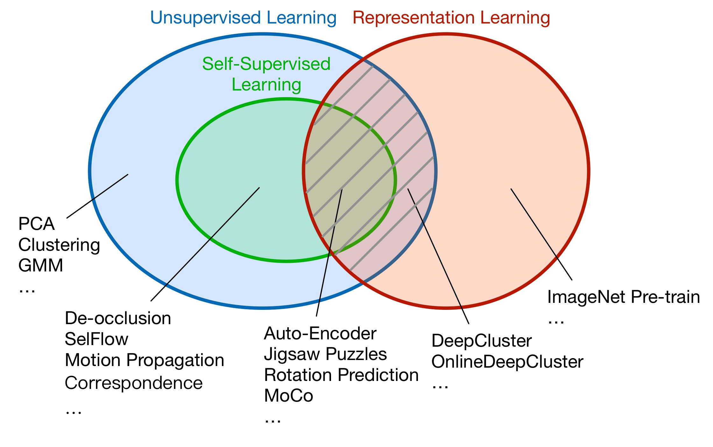

# OpenSelfSup

**News**
* Downstream tasks now support more methods(Mask RCNN-FPN, RetinaNet, Keypoints RCNN) and more datasets(Cityscapes).
* 'GaussianBlur' is replaced from Opencv to PIL, and MoCo v2 training speed doubles!    
(time/iter 0.35s-->0.16s, SimCLR and BYOL are also affected.)
* OpenSelfSup now supports [Mixed Precision Training (apex AMP)](https://github.com/NVIDIA/apex)!
* A bug of MoCo v2 has been fixed and now the results are reproducible.
* OpenSelfSup now supports [BYOL](https://arxiv.org/pdf/2006.07733.pdf)!

## Introduction

The master branch works with **PyTorch 1.1** or higher.

`OpenSelfSup` is an open source unsupervised representation learning toolbox based on PyTorch.

### What does this repo do?

Below is the relations among Unsupervised Learning, Self-Supervised Learning and Representation Learning. This repo focuses on the shadow area, i.e., Unsupervised Representation Learning. Self-Supervised Representation Learning is the major branch of it. Since in many cases we do not distingush between Self-Supervised Representation Learning and Unsupervised Representation Learning strictly, we still name this repo as `OpenSelfSup`.

### Major features

- **All methods in one repository**

  <em>For comprehensive comparison in all benchmarks, refer to [MODEL_ZOO.md](docs/MODEL_ZOO.md). Most of the selfsup pretraining methods are under the `batch_size=256, epochs=200` setting.</em>
  <table><thead><tr><th>Method</th><th>VOC07 SVM (best layer)</th><th>ImageNet (best layer)</th></tr></thead><tbody>
<tr><td><a href="https://github.com/pytorch/vision/blob/master/torchvision/models/resnet.py" target="_blank" rel="noopener noreferrer">ImageNet</a></td><td>87.17</td><td>76.17</td></tr>
<tr><td>Random</td><td>30.54</td><td>16.21</td></tr>
<tr><td><a href="https://www.cv-foundation.org/openaccess/content_iccv_2015/papers/Doersch_Unsupervised_Visual_Representation_ICCV_2015_paper.pdf" target="_blank" rel="noopener noreferrer">Relative-Loc</a></td><td>64.78</td><td>49.31</td></tr>
<tr><td><a href="https://arxiv.org/abs/1803.07728" target="_blank" rel="noopener noreferrer">Rotation-Pred</a></td><td>67.38</td><td>54.99</td></tr>
<tr><td><a href="https://arxiv.org/abs/1807.05520" target="_blank" rel="noopener noreferrer">DeepCluster</a></td><td>74.26</td><td>57.71</td></tr>
<tr><td><a href="https://arxiv.org/abs/1805.01978" target="_blank" rel="noopener noreferrer">NPID</a></td><td>74.50</td><td>56.61</td></tr>
<tr><td><a href="http://openaccess.thecvf.com/content_CVPR_2020/papers/Zhan_Online_Deep_Clustering_for_Unsupervised_Representation_Learning_CVPR_2020_paper.pdf" target="_blank" rel="noopener noreferrer">ODC</a></td><td>78.42</td><td>57.70</td></tr>
<tr><td><a href="https://arxiv.org/abs/1911.05722" target="_blank" rel="noopener noreferrer">MoCo</a></td><td>79.18</td><td>60.60</td></tr>
<tr><td><a href="https://arxiv.org/abs/2003.04297" target="_blank" rel="noopener noreferrer">MoCo v2</a></td><td>84.26</td><td>67.69</td></tr>
<tr><td><a href="https://arxiv.org/abs/2002.05709" target="_blank" rel="noopener noreferrer">SimCLR</a></td><td>78.95</td><td>61.57</td></tr>
<tr><td><a href="https://arxiv.org/abs/2006.07733" target="_blank" rel="noopener noreferrer">BYOL (epoch=300)</a></td><td>86.58</td><td>72.35</td></tr>
</tbody></table>

- **Flexibility & Extensibility**

  `OpenSelfSup` follows a similar code architecture of MMDetection while is even more flexible than MMDetection, since OpenSelfSup integrates various self-supervised tasks including classification, joint clustering and feature learning, contrastive learning, tasks with a memory bank, etc.

  For existing methods in this repo, you only need to modify config files to adjust hyper-parameters. It is also simple to design your own methods, please refer to [GETTING_STARTED.md](docs/GETTING_STARTED.md).

- **Efficiency**

  All methods support multi-machine multi-gpu distributed training.

- **Standardized Benchmarks**

  We standardize the benchmarks including logistic regression, SVM / Low-shot SVM from linearly probed features, semi-supervised classification, and object detection. Below are the setting of these benchmarks.

  | Benchmarks                       | Setting                                                                                                                                                                     | Remarks                                      |
  |----------------------------------|-----------------------------------------------------------------------------------------------------------------------------------------------------------------------------|-------------------------------------------------|
  | ImageNet Linear Classification (Multi) | [goyal2019scaling](http://openaccess.thecvf.com/content_ICCV_2019/papers/Goyal_Scaling_and_Benchmarking_Self-Supervised_Visual_Representation_Learning_ICCV_2019_paper.pdf) | Evaluate different layers.             |
  | ImageNet Linear Classification (Last) | [MoCo](http://openaccess.thecvf.com/content_CVPR_2020/papers/He_Momentum_Contrast_for_Unsupervised_Visual_Representation_Learning_CVPR_2020_paper.pdf) | Evaluate the last layer after global pooling. |
  | Places205 Linear Classification  | [goyal2019scaling](http://openaccess.thecvf.com/content_ICCV_2019/papers/Goyal_Scaling_and_Benchmarking_Self-Supervised_Visual_Representation_Learning_ICCV_2019_paper.pdf) | Evaluate different layers.             |
  | ImageNet Semi-Sup Classification |
  | PASCAL VOC07 SVM                 | [goyal2019scaling](http://openaccess.thecvf.com/content_ICCV_2019/papers/Goyal_Scaling_and_Benchmarking_Self-Supervised_Visual_Representation_Learning_ICCV_2019_paper.pdf) | Costs="1.0,10.0,100.0" to save evaluation time w/o change of results. |
  | PASCAL VOC07 Low-shot SVM        | [goyal2019scaling](http://openaccess.thecvf.com/content_ICCV_2019/papers/Goyal_Scaling_and_Benchmarking_Self-Supervised_Visual_Representation_Learning_ICCV_2019_paper.pdf) | Costs="1.0,10.0,100.0" to save evaluation time w/o change of results. |
  | PASCAL VOC07+12 Object Detection | [MoCo](http://openaccess.thecvf.com/content_CVPR_2020/papers/He_Momentum_Contrast_for_Unsupervised_Visual_Representation_Learning_CVPR_2020_paper.pdf)                      |                                                 |
  | COCO17 Object Detection          | [MoCo](http://openaccess.thecvf.com/content_CVPR_2020/papers/He_Momentum_Contrast_for_Unsupervised_Visual_Representation_Learning_CVPR_2020_paper.pdf)                      |                                                 |

## Change Log

Please refer to [CHANGELOG.md](docs/CHANGELOG.md) for details and release history.

[2020-10-14] `OpenSelfSup` v0.3.0 is released with some bugs fixed and support of new features.

[2020-06-26] `OpenSelfSup` v0.2.0 is released with benchmark results and support of new features.

[2020-06-16] `OpenSelfSup` v0.1.0 is released.

## Installation

Please refer to [INSTALL.md](docs/INSTALL.md) for installation and dataset preparation.

## Get Started

Please see [GETTING_STARTED.md](docs/GETTING_STARTED.md) for the basic usage of OpenSelfSup.

## Benchmark and Model Zoo

Please refer to [MODEL_ZOO.md](docs/MODEL_ZOO.md) for for a comprehensive set of pre-trained models and benchmarks.

## License

This project is released under the [Apache 2.0 license](LICENSE).

## Acknowledgement

- This repo borrows the architecture design and part of the code from [MMDetection](https://github.com/open-mmlab/mmdetection).
- The implementation of MoCo and the detection benchmark borrow the code from [moco](https://github.com/facebookresearch/moco).
- The SVM benchmark borrows the code from [
fair_self_supervision_benchmark](https://github.com/facebookresearch/fair_self_supervision_benchmark).
- `openselfsup/third_party/clustering.py` is borrowed from [deepcluster](https://github.com/facebookresearch/deepcluster/blob/master/clustering.py).

## Contributors

We encourage researchers interested in Self-Supervised Learning to contribute to OpenSelfSup. Your contributions, including implementing or transferring new methods to OpenSelfSup, performing experiments, reproducing of results, parameter studies, etc, will be recorded in [MODEL_ZOO.md](docs/MODEL_ZOO.md). For now, the contributors include: Xiaohang Zhan ([@XiaohangZhan](http://github.com/XiaohangZhan)), Jiahao Xie ([@Jiahao000](https://github.com/Jiahao000)), Enze Xie ([@xieenze](https://github.com/xieenze)), Xiangxiang Chu ([@cxxgtxy](https://github.com/cxxgtxy)), Zijian He ([@scnuhealthy](https://github.com/scnuhealthy)).

## Contact

This repo is currently maintained by Xiaohang Zhan ([@XiaohangZhan](http://github.com/XiaohangZhan)), Jiahao Xie ([@Jiahao000](https://github.com/Jiahao000)) and Enze Xie ([@xieenze](https://github.com/xieenze)).
