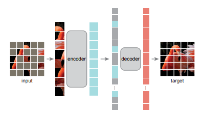

# MAE Experimental

## Masked Autoencoders Are Scalable Vision Learners


<!-- [ABSTRACT] -->

This paper shows that masked autoencoders (MAE) are
scalable self-supervised learners for computer vision. Our
MAE approach is simple: we mask random patches of the
input image and reconstruct the missing pixels. It is based
on two core designs. First, we develop an asymmetric
encoder-decoder architecture, with an encoder that operates only on the
visible subset of patches (without mask tokens), along with a lightweight
decoder that reconstructs the original image from the latent representation
and mask tokens. Second, we find that masking a high proportion
of the input image, e.g., 75%, yields a nontrivial and
meaningful self-supervisory task. Coupling these two designs enables us to
train large models efficiently and effectively: we accelerate
training (by 3× or more) and improve accuracy. Our scalable approach allows
for learning high-capacity models that generalize well: e.g., a vanilla
ViT-Huge model achieves the best accuracy (87.8%) among
methods that use only ImageNet-1K data. Transfer performance in downstream tasks outperforms supervised pretraining and shows promising scaling behavior.

<!-- [IMAGE] -->
<div align="center">

</div>

## Citation

<!-- [ALGORITHM] -->

```bibtex
@article{He2021MaskedAA,
  title={Masked Autoencoders Are Scalable Vision Learners},
  author={Kaiming He and Xinlei Chen and Saining Xie and Yanghao Li and
  Piotr Doll'ar and Ross B. Girshick},
  journal={ArXiv},
  year={2021},
  volume={abs/2111.06377}
}
```

## Models and Benchmarks

Here, we report the results of the model, which is pre-trained on ImageNet1k
for 400 epochs, the details are below:


| Model | Backbone | Pre-train epoch | Fine-tuning Top-1 |                           Pre-train config                           |                                   Fine-tuning config                                    |                                                  Pre-train log                                                   |                                               Fine-tuning log                                                |                                                Pre-train weight                                                 |
| :---: | :------: | :-------------: | :---------------: | :------------------------------------------------------------------: | :-------------------------------------------------------------------------------------: | :--------------------------------------------------------------------------------------------------------------: | :----------------------------------------------------------------------------------------------------------: | :-------------------------------------------------------------------------------------------------------------: |
|  MAE  | Vit-B/16 |       400       |       82.93       | [config](configs/selfsup/mae/mae_vit-b-16_8xb512-coslr-400e_in1k.py) | [config](configs/benchmarks/classification/imagenet/vit-b-16_8xb128-coslr-100e_in1k.py) | [log](https://download.openmmlab.com/mmselfsup/mae/mae_vit-b-16_8xb512-coslr-400e_in1k_20220104_102206.log.json) | [log](https://download.openmmlab.com/mmselfsup/mae/vit-b-16_8xb128-coslr-100e_in1k_20220106_105846.log.json) | [model](https://download.openmmlab.com/mmselfsup/mae/mae_vit-b-16_8xb512-coslr-400e_in1k_20220107-4f3b0ae2.pth) |


Since this version is in experiment, some of the code may not follow the code
style of OpenMMLab, e.g. missing docstring, but we will fix it in our official
version. Please stay tuned !
