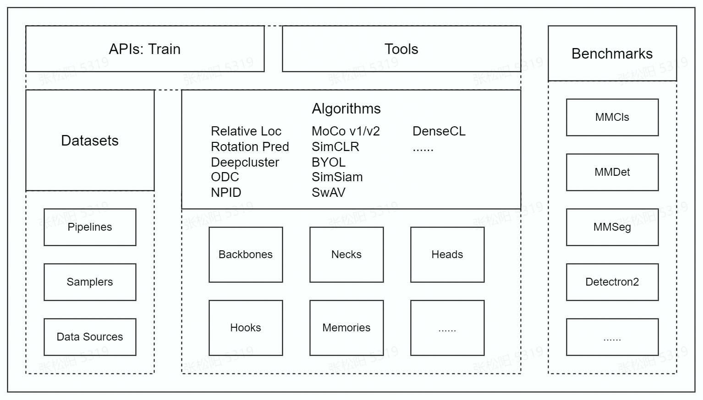

# Overview

- [Overview](#overview)
  - [Introduction of Self-supervised Learning](#introduction-of-self-supervised-learning)
  - [Design of MMSelfSup](#design-of-mmselfsup)
  - [Hands-on Roadmap of MMselfSup](#hands-on-roadmap-of-mmselfsup)

In this section, We would like to give a quick review of the open-source library [MMSelfSup](https://github.com/open-mmlab/mmselfsup).

We will first illustrate the basic idea of the self-supervised learning, then we will briefly describe the design of MMSelfSup. After that, we will provide a hands-on roadmap to help the users to play with MMSelfSup

## Introduction of Self-supervised Learning

Self-supervised learning(SSL) is a promising learning paradigm, which aims to leverage the potential of the huge amount of unlabeled data. In SSL, we typically uses the label generated automatically without human labor, to learn a model to extract the discriminative representation of the data. Equipped with the powerful pre-trained model by SSL, we are able to improve various downstream vision tasks currently.

The community has witnessed rapid development of SSL in the past few years. Our codebase aims to become an easy-to-use and user-friendly library, to help the research and engineering. We will elaborate the properties and design of MMSelfSup in the following sections.

## Design of MMSelfSup

MMSelfSup follows the modular designed architecture as other OpenMMLab projects. We illustrate the overall framework is illustrated as below:

  

- **Datasets** provides the support for various datasets, with many useful augmentation strategy.
- **Algorithms** consists of many milestone SSL works with easy-to-use interface.
- **Tools** includes the training and analysis tools for SSL
- **Benchmarks** introduces many examples of how to use SSL for various downstream tasks(e.g., classification, detection, segmentation and etc.).

## Hands-on Roadmap of MMSelfSup

To help the user to use the MMSelfSup quickly, we recommend the following roadmap for using our library.

### Play with MMSelfSup

Typically, SSL is considered as the pre-training algorithm for various model architectures. Thus, the complete pipeline consists of the **pre-training** stage and the **benchmark** stage.

- For the user who want to try MMSelfSup with various SSL algorithms. We first refer the user to [Get Started](<>) for the **environment setup**.

- For the pre-training stage, we refer the user to [Pre-train](https://mmselfsup.readthedocs.io/en/dev-1.x/user_guides/#pretrain) for using various SSL algorithms to obtain the pre-trained model.

- For the benchmark stage, we refer the user to [Benchmark](https://mmselfsup.readthedocs.io/en/dev-1.x/user_guides/#downstream-tasks) for examples and usage of applying the pre-trained models in many downstream tasks.

- Also, we provide some analysis tools and visualization tools[(Useful Tools)](https://mmselfsup.readthedocs.io/en/dev-1.x/user_guides/#downstream-tasks) to help  diagnosing the algorithm.

### Learn SSL with MMSelfSup

If you are new to SSL, we recommend using the [Model Zoo](https://mmselfsup.readthedocs.io/en/dev-1.x/model_zoo.html) as a reference to learn the milestones SSL algorithms.
